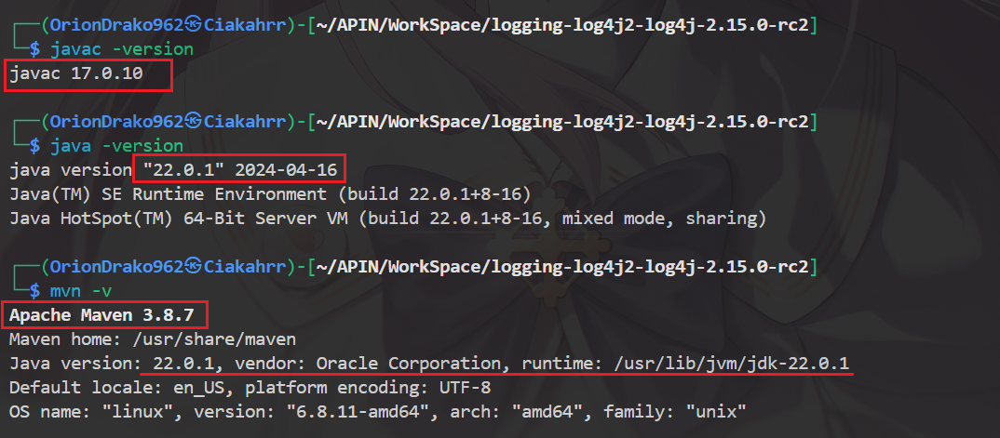

# 来自邪恶猎户座六同盟成员之一的CiakahrrDraconian**程龙**的防御报告
## 目录
- [来自邪恶猎户座六同盟成员之一的CiakahrrDraconian**程龙**的防御报告](#来自邪恶猎户座六同盟成员之一的ciakahrrdraconian程龙的防御报告)
  - [目录](#目录)
  - [简介](#简介)
    - [前言](#前言)
      - [漏洞利用缓解（攻击识别蜜罐的搭建）](#漏洞利用缓解攻击识别蜜罐的搭建)
      - [漏洞修复（二进制级别）](#漏洞修复二进制级别)
      - [漏洞修复（源代码级别）](#漏洞修复源代码级别)

## 简介

- 扮演角色：蓝队成员
- 主要任务：**漏洞利用的缓解与漏洞修复**（二进制和源代码级别）

### 前言

本次实验我力求在模拟真实漏洞攻防过程的情况下去思考解决策略与进行解决。
以下内容为漏洞利用缓解和修复的完整过程，我个人详细的探索过程以及debug过程在[honey-pot_timeline.md](TimeLine/honey-pot_timeline.md)以及[log4j2_timeline.md](./TimeLine/log4j2_timeline.md)中有非常详细的介绍。

---

#### 漏洞利用缓解（攻击识别蜜罐的搭建）

- [详细版本和错误处理点此](TimeLine/honey-pot_timeline.md)
- 思路：从网上找了一个`log4j`的蜜罐，本地搭建后申请一个`webhook`的接口并接入该蜜罐。当蜜罐检测到`log4j`攻击的匹配串时立刻发出告警通知维护人员。
- 1. 先下载仓库，拉取docker镜像到本地

  
  
- 2. 申请`Slack`的`Incoming Webhook`接口并测试

  
  
  
  
  
- 3. 运行docker容器，查看蜜罐是否工作

  
  
- 4. 仔细阅读蜜罐官方的`app.py`，了解其工作原理，以便自己构造`payload`

  
- 5. 构造`payload`并发送，蜜罐成功识别攻击并通过`webhook` 发送通知

  
  
- 要实现更多攻击识别以及其他预警功能，只需要修改`app.py`就可以了。也可以直接通知`POST`内容（因为走蜜罐的流量大概率是攻击者的），来给需要防御的靶机的网络防火墙的过滤规则提供参考。

---

#### 漏洞修复（二进制级别）

- [详细版本和错误处理点此](./TimeLine/log4j2_timeline.md#二进制级别)
- 思路：先从`demo.jar`中提取我们需要修改的`spring-boot-2.1.3.RELEASE.jar`，再从其中提取`log4j2.xml`，修改后放回`spring-boot-2.1.3.RELEASE.jar`，再将`spring-boot-2.1.3.RELEASE.jar`放回`demo.jar`。
- 1. 首先准备好`demo.jar`以及工作文件夹（非必要，为了不混淆文件结构建立）。通过`jar -tf`命令查看`spring-boot-2.1.3.RELEASE.jar`在`demo.jar`中的位置，再配合`jar -xf`命令将其单独提取出来。提取出来的文件会保持其在`jar`包中的目录结构。进入lib文件夹后对其使用`jar -tf`命令，查找`log4j2.xml`配置文件的位置。提取`log4j2.xml`，其仍然保持了目录结构。直接对其进行修改。

     
- 2. 按照提供的方式对配置文件中的`%m`进行属性值配置

     
- 3. 修改完成。先使用`zip -d`删除`spring-boot-2.1.3.RELEASE.jar`中的`log4j2.xml`文件，防止更新覆盖失败。然后使用`jar -uf`指令将其以压缩方式放回`jar`。

     
- 4. 接着来到外层文件夹，删除`org`文件夹，使得`lib`下仅有`spring-boot-2.1.3.RELEASE.jar`。

     
- 5. 然后把之前解压出的文件目录都转移到和`demo.jar`同级。（删除`demo.jar`中的`spring-boot-2.1.3.RELEASE.jar`以防止更新覆盖失败）。然后将`spring-boot-2.1.3.RELEASE.jar`以非压缩的方式（参数`-0`）放回`demo.jar`。这样就得到了一个二进制级别进行修复的`demo.jar`

     

#### 漏洞修复（源代码级别）

- [详细版本和错误处理点此](./TimeLine/log4j2_timeline.md#源代码级别)
- 思路：自己改编源代码或者使用原作者或其他可信的代码补丁，创建项目工程并进行编译，将编译完成的无害`log4j-*jar`包打进`demo.jar`中。
- 0. 一些基础的环境的配置以及文件配置

  - `java`:22/`javac`:17/`maven`:3.8.7

  

  - 解压`loag4j2-2.15.0-rc2`的源码

  

  - 运行`mvn`命令，构建基础仓库
- 

  - 确认本地仓库生成（默认为`~/.m2/repository`）

  

  - 在构建前可以更改官方提供的`toolchains.xml`来链接`jdk9`

  

  - 配置如图

  

  - 我直接传入事先配置好的`toolchains.xml`

  

  - 进入`lo4j-jmx-gui`，修改配置文件来使得后面不会出现`/lib/../jconsole.jar`的错误匹配（同时建议`jdk`环境没有该`jconsole.jar`包的也添加一下）

  
- 1. 开始构建（跳过测试类）

  
- 2. 构建成功！

  
- 3. 将`log4j-core-2.15.0.jar`以及`log4j-api-2.15.0.jar`打进`demo.jar`

  
- 4. 删除原`demo.jar`中的`log4j-core-2.14.0.jar`和`log4j-api-2.14.0.jar`

  
- 5. 修改`pom.xml`中的版本信息

  
- 6. 将`pom.xml`打入`demo.jar`

  
- 这样编译出来的包（此时我还没有解决在报告中提到的那个BOSS级bug，编译的时候直接`rm`了一个类）打进`demo.jar`后无法启动容器。参考[后记](./TimeLine/log4j2_timeline.md#后记)，问题就成功解决了。

- 然后对得到的两个修复后的`demo.jar` 进行验证：

  

- 至此，本次漏洞修复可以说基本完成了。
