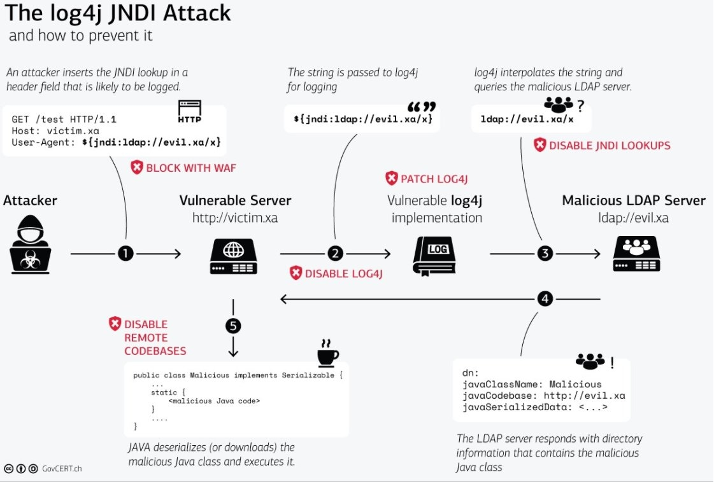

# 邪恶猎户六同盟成员之一的猎户座天龙人的个人实验报告——针对log4j2攻击进行告警的蜜罐搭建时间线过程
## 简介
- 扮演角色：蓝队成员
- 主要任务：**漏洞利用的缓解与漏洞修复**（二进制和源代码级别）
---
- Ⅰ.灵感产生
  - 让我产生要做一个蜜罐的灵感的来源是在观看老师的视频的时候看到下面的这张图：
  
  

  - 其中第一步提到要可以利用网络防火墙进行深度包检测来把攻击者拦截在第一步，让其“进不来”。于是在和同伙yt同学讨论之后决定交给他来实现（当时我正在做漏洞修复）。但是不久之后等到同伙的防火墙有了一点实现的时候，我听了其思路后突然想到。为什么深度包检测的时候，这个防火墙非要去检测`${jndi:ladp://evil.xa/x}`这个串不可呢？说到底都是在`CVE-2021-44228`漏洞发现之后才产生的防范措施（当然这里可能说错了，也许更早的时候就开始防范这个攻击了，但是不影响这种防范需要一个“起始点”或者说“最初的动机”）。于是我又开始思考，在真实情况下，没有人来告诉我维护的项目中有哪个包存在哪个漏洞，又会被攻击者用何种方式利用，在这种情况下我如何及时发现攻击并把攻击相关的串写进网络防火墙从而实现阻断呢？这时灵感迸发，突然回想起上上学期令我印象深刻的蜜罐实验（虽然当时完成的内容很少，但是写实验报告的时候思考了很多，所以记忆犹新）。
  - 于是我产生了一个大胆的想法：何不部署蜜罐呢？既可以大大得降低我们的服务器被攻击者第一个攻击的可能性，又能及时捕获攻击者的攻击行为、攻击者的个人信息等，及时更新网络防火墙的过滤规则从而打造一个防御的铜墙铁壁。同时蜜罐收集的信息也能给我们在漏洞修复的时候提供思路，一箭三雕，岂不美哉？

  - 我和同伙分享这个思路之后先去继续完成我的漏洞修复工作，让他在空闲之余先着手研究一下。但是据他说没有成功部署。于是在漏洞修复的工作完成之后我又自己动手尝试了一下部署蜜罐。以下就是这个蜜罐部署和捕获攻击者信息的时间线流程

- Ⅱ.log4j-honeypot-flask蜜罐的部署——“捕灵网计划”
  - 首先是同伙分享给我了一个关于`log4j`攻击防护的低交互蜜罐项目：[探秘内部网络防护新利器：log4j-honeypot-flask](https://blog.csdn.net/gitblog_00043/article/details/139644958)以及其项目地址[log4j-honeypot-flask](https://github.com/BinaryDefense/log4j-honeypot-flask)。于是我立即开始着手部署准备边做边学。
  - 先将项目仓库拉取到本地
  
  

  - 然后按照`REAMME`进行`build`，但是在拉取镜像的时候出现了一个错误。`python-dev`这个包证书失效没有了，取代它的是`python-dev-is-pyhon3`。

  

  - 我本机`apt search`发现这个包确实还在的时候，便修改了`Dockerfile`来下载`python-dev-is-python3`这个包，拉取镜像成功

  
  
  

  - 接下来要运行镜像容器了。看到需要一个参数`WebHook_Url`。我有点懵了，不太懂是啥。看了一下项目介绍，说是放我们用来接收通知的`WebHookUrl`。同时提供了三个参考的平台`Slack`、`Teams`、`Mattermost`。
  
  

  - 由于不知道`Webhook`是什么，我去网上查了一下。在阅读这篇[轻量的 WebHook 工具：歪脖虎克](https://soulteary.com/2024/04/06/lightweight-webhook-tool.html)之后。我明白了`Webhook`大概是个啥，同时也得知了这个“钩子”用的比较多的地方是自动化部署代码。但是今天我们要实现的是"incoming webhook"，就不去详细展开说了。我注册了[Slack](https://app.slack.com/)平台，并在[Slack Api](https://api.slack.com/)中申请`App`。

  
  
  - 申请完成后可以用测试用例来测试一下是否成功
  
  
  

  - 可以看到成功了。
  
  

  - 接下来把`WEBHOOK_URL`填入参数，端口映射为`8080->8080`，启动容器。
  
  

  - 看到成功跑起来了。
  
  

  - 接下来为了构造`payload`来进行测试，我先阅读了官方的`app.py`脚本。脚本写的非常清晰简洁，连我这种代码白痴都能看懂。
  
  

  - 然后我就构造`payload`进行攻击了。本来我是又开了一台虚拟机准备把那个当成攻击机使用。但是发生了意外：这个靶机可以`ping`通网关路由和那台虚拟机，那台虚拟机也能`ping`通网关路由，但是就是`ping`不同这台靶机。于是我只好在这台靶机上发送`payload`准备自欺欺人。但是出现了一个状况，靶机构造好的`payload`一旦发送出去，虽然能被蜜罐成功捕获和识别，但是查看蜜罐日志（明明截图了，现在找不到了），发现所有`payload`带的识别串都莫名其妙消失了，被还原成标准的`POST`格式发送给了蜜罐。因此蜜罐虽然识别了，但是没有识别出威胁。
  
  

  - 然后我有如神助，想到了`cmd`。立马进入`cmd`进行尝试。结果直接成功！
  
  
  

  - 不过我还是没搞清楚为什么在靶机上发送`payload`，`payload`的内容就会被重构。
  - 实验成功之后说明该蜜罐可以及时得把关于`log4j`的攻击反馈给护网人员。在真实的情况下，如果要实现我们一开始的目标，我们可以直接修改`app.py`中解析`HTTP`请求的函数，使得收到`HTTP`请求就立刻把请求报告给`webhook`（因为这是一个蜜罐环境，能在蜜罐产生流量交互的基本可以排除是人畜无害的普通用户了，大概率是别有用心的攻击者），这样就可以对攻击做出第一时间的响应，也能为漏洞修复争取非常宝贵的时间！

