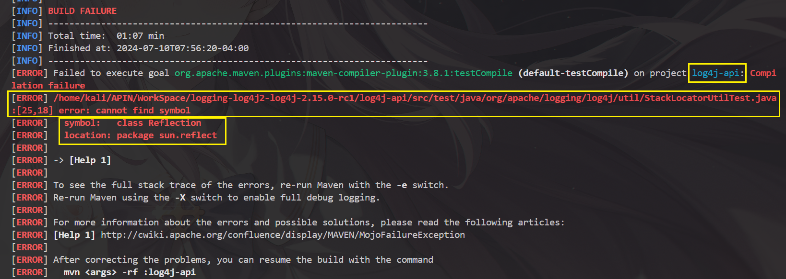

# 邪恶猎户六同盟成员之一的猎户座天龙人的个人实验报告——log4j2漏洞修复时间线过程

## 简介
- 扮演角色：蓝队成员
- 主要任务：**漏洞利用的缓解与漏洞修复**（二进制和源代码级别）

## 目录
- [二进制级别](#二进制级别)
- [源代码级别](#源代码级别)
- [后记](#后记)
---

### 二进制级别
- Ⅰ.研究原理

  - 在整个项目伊始，除了用反编译来定位漏洞文件外，我对整个漏洞修复的大体流程还没有一个准确的概念。一切的起因都在于同伙在群中发了如下一张截图：

    [](https://blog.csdn.net/lqzkcx3/article/details/82050375)

  - 顺藤摸瓜找到原文地址后，发现该解决方案是[Apache log4j2官方](https://logging.apache.org/log4j/2.x/security.html)在其`Security.html`中提供的。

    [](https://logging.apache.org/log4j/2.x/security.html)

  - 但是可以发现，随着官方的版本更新，已经把之前的操作给移除了，转而可以在官方的[Release Note](https://logging.apache.org/log4j/2.x/release-notes.html)中找到。

    [](https://logging.apache.org/log4j/2.x/release-notes.html)

  - 同时也在[官方 issues](https://issues.apache.org/jira/browse/LOG4J2-3198)上找到了相关记录，验证了这些操作来自可信信源。

    [](https://issues.apache.org/jira/browse/LOG4J2-3198)

- Ⅱ.实践操作

  - 我准备使用第二种方案，即：`设置log4j2.xml文件中的 %m 为 %m{nolookups}`
  - 首先把提取出来的`demo.jar`scp传入自己的kali虚拟机中。

    

  - 然后就准备开始反编译了。
    我首先根据风评找了一个不错的`linux命令行反编译java`的工具`procyon`。
    `sudo apt install procyon-decompiler`
  - 安装完成后大体学习了一下简单的使用命令，就直接使用`procyon [jarfile] -o [output directory]`进行反编译。

    

  - 结果反编译后原本一个16M大小的包 直接变成几百K。后来我回忆起小时候玩MC时曾为了修改模组文件对`jar包`进行过解压，我猛然的意识到`jar包`其实就是一个有特殊目录结构的压缩包而已。在`windows`上使用`java-decompiler`进行的反编译只有在`.class`层面才是真正的反编译，其所展示的复杂的目录其实就是解压`jar`得到的结果罢了。
  - 那还说什么。直接使用`jar`命令对`jar包`进行解压，得到所谓“反编译”后的文件夹。(这个过程还有一个注意点，`jar`命令的解压是把文件解压在当前目录的，所以要先进入预留好的文件夹再进行解压)

    

  - 使用`jar -tvf [.jar] | grep [target]`命令进行查找，找到`log4j2.xml`文件所在的位置。其实这个过程更加严谨的操作是写一个脚本对该`lib`下的`jar包`进行批量操作来定位这个文件。但是鉴于时间关系以及假设我们已经通过特别的方式(开发人员自己就知道这个文件在哪个包里，非开发的运维人员也可以通过其他的逆向工具定位这个文件)得知其位置，就不写脚本了。

    

  - 其实知道这个文件的位置之后完全可以参照[linux中对jar文件的操作](https://www.cnblogs.com/zhizhixiaoxia/p/17285815.html)这篇博客来进行文件的提取、修改与更新覆盖。但是当时我还没有看到这篇文章，就用了最原始的方法：解压文件、修改文件、重新打包

    
    

  - 如图所示，`%m`后添加属性修改为`%m{nolookups}`

    

  - 接下来删除原来的那个jar包，用原来的包名打包该文件夹，然后打包整个文件为demo.jar

    
    
    
  - **方案完成！**
  - 在二进制这个层面上，也可以参考老师提供的这篇文章[从零到一带你深入 log4j2 Jndi RCE CVE-2021-44228漏洞](https://www.anquanke.com/post/id/263325#h2-6)来添加配置文件以达到同样的效果。这里根据实际版本的缘故，不太推荐直接把`JndiLookup`类给直接删除。

---

### 源代码级别

- Ⅰ.研究原理
  - 我参考老师给的[从零到一带你深入 log4j2 Jndi RCE CVE-2021-44228漏洞](https://www.anquanke.com/post/id/263325)，大概摸清了这个漏洞的原理。文中指出`Apache Log4j2`官方的修复方案是：[**默认禁用了jndi协议，并且在初始化插值器时新增了检查jndi协议是否启用的判断。**](https://github.com/apache/logging-log4j2/commit/44569090f1cf1e92c711fb96dfd18cd7dccc72ea)

    

  - 我一开始想的很简单，你不就是添加了一个新函数，然后删改了某些代码吗。那我反编译`jar包`，改动源代码后编译回去不就行了吗。
    - 先解压缩，并创建了一个工作目录

      

    - 提取出`Interpolator.class`类文件

      

    - 反编译`Interpolator.class`得到`Interpolator.java`

      

  - 然后开始对着`github`上的[commits](https://github.com/apache/logging-log4j2/commit/44569090f1cf1e92c711fb96dfd18cd7dccc72ea)进行一些列的借鉴抄袭照搬。

    
    
    

  - 改的差不多了，我直接使用`javac`进行编译，旋即报错

    

  - 看到这些报错，我立马想到了是找不到库文件导致的，这就说明编译这个`java`的环境必须是一个工程项目，使其能够定向至引用的库文件。于是我开始思考要怎么编译。于是我想到了，作为蓝队。如果我就是这个包的开发者，那我理应有这个包的工程项目，可以随时进行类函数的改写以及编译。即便我不是这个包的开发者，那我除了上述的二进制级别的补救措施外，一定是去作者的仓库下载这个版本的源代码然后修改后再本地编译成新的`jar包`来引入自己的这个项目使用。
  - 作为本次实验的蓝队，我扮演的角色恰好就是这样一个非开发者的角色，我现在要做的事情就是在作者没有给出补丁的情况下自己更改项目的源代码并编译然后使用。惋惜的是，即便我真的是一个老运维人员，对于没有参与到开发中的我来说想要自己一步到位做好源代码的修改也是一件费时费力的事。庆幸的是，我并非经验重复的运维，而官方也早就发布了针对这个漏洞的补丁[log4j-2.15.0-rc2](https://github.com/apache/logging-log4j2/releases/tag/log4j-2.15.0-rc2)版本。我们可以假装这是我们自己更改的已经修复漏洞的源代码，现在要做的就是编译并把它重新放进我自己的项目中。
  - 首先下载源代码到虚拟机，查看目录结构后问ai相关编译工具。
- 
    
    

```bash
# 安装maven
sudo apt install maven
  
# 修改maven的镜像源仓库以加速构建
sudo vim /etc/maven/settings.xml
# 进行修改

# 进入log4j-core文件夹，准备构建
cd log4j-core
```

- 然后使用`mvn clean install`进行构建。接下来就遇到了我的第一个问题：

  

- 初入`maven`的我根本不清楚`maven`的配置情况，在网上也难以找到相同的报错和解决方案（因为网上的`maven`大多用的都是Windows环境，至于为什么，后面的实验中我会得出答案的）。没有怀疑刚刚安装过的`maven`，我怀疑是kali自带的`java`环境不够完整导致的（其实这个怀疑完全正确，只不过我的解决方法可以说是让人大跌眼镜，以至于一个小小的编译我做了差不多整整两天的时间）。于是我着手开始准备配置`java`。使用`apt`包管理工具无法直接下载`java`，我便在`pkg.kali.org`上寻找有关`jdk`的包，找到后我挑了最新版本直接`apt`安装。安装后我直接就使用`maven`再次构建，但是结果还是一样失败。我怀疑是`maven`没有正确链接到`java`，即`jdk`没有正确配置环境变量，于是我找进`jdk`的安装目录。结果当时看到有好几个版本的`jdk`在那躺着。当时我不知从什么地方得来的经验自以为是`jdk`之间互相冲突了，直接`rm`送了原装的`jdk-17`下地狱。然后环境变量配置了我新`apt`的那个`jdk`。但是这样之后还是不行。后来看到了一篇子工程父工程的文章，里面就是说要整个文件一起`package`或者`install`，否则可能会有子工程缺少依赖项。于是我出了这个`log4j-core`文件夹，对整个工程进行`install`。
- 一切就绪后我又重新`mvn clean install`，果然没出错了。过了一段时间，第二个报错它来了！

  

- 这个问题不管是丢给ai还是搜索引擎，出来的结果还是那老一套，说是我的`java`和`javac`版本不一致啥的，或者是我的`~/.m2`仓库内的工具链没有成功配置。我听信了ai的鬼话把`~/.m2`仓库删了之后再次构建，还是报错。反复各种尝试无果后我怒了😡，准备直接去网上找现成的`log4j2-2.15.0.jar`。结果包没找到，让我找到了一篇文章:[关于log4j漏洞修复解决方案及源码编译](https://www.cnblogs.com/chengpanpan/p/15685597.html).其中就提到了我遇到的这个问题。我欣喜若狂，旋即去下载了`java9`并跟着教程邯郸学步地解压到java指定目录下，配置好后发现被我删除的`~/.m2`仓库没有回来，我也没有发现是我从网上找的`/etc/maven/settings`文件把本地仓库的地址和命名偷偷改了。找不到这个仓库就无法按照教程修改`toolchains.xml`，于是我只能去`/etc/maven/`下进行修改。修改完成后进行构建，发现系统没有使用我下载的`jdk-9.0.1`。我也忘记是哪篇文章了，看到了一个`sudo update-alternatives --config java`该指令可以指定使用的`java`版本。修改后再次构建，这个报错也解决了。
- 然后遇到了一个死尸级ERROR，连BOSS战都不能形容其凶悍程度，这个报错到整个实验结束都没能成功解决。接下来几乎整整一天的时间都是围绕着这个报错展开的。

  

- 我先是去它给出的链接地址查看，发现那个完全一点关系都没有。接着我借助ai和搜索引擎，仍然找不到解决方法。我一横心决定直接换个版本的`maven`再试一次。于是我把`3.8.7`版的`maven`降级成`3.6.3`(网上一个成功用linux编译成功的就是这个版本)。

  

- 结果错误仍然存在。终于我在另外一篇关于编译`log4j-2.15.0-rc2`的文章里找到了方法：[跟风蹭热度编译个logging-log4j2包-jdk11](https://www.cnblogs.com/zihunqingxin/p/15674069.html)

  

- 虽然我不是古人，但不知为什么我的阅读方向是从右往左的，我先看到`直接删除后继续和测试代码`，然后看到`由于是在docker里用openjdk编译，jdk环境可能不完整`。先打了你一鞭子再给你一颗糖，你说你要鞭子还是要糖？更何况我生怕删除后又出现连锁反应或是`jar`包有损坏。于是果断选择想方设法地去建立一个`完整的jdk环境`。
- 我首先注意到`openjdk`这个词，产生了疑问。难道不在`docker`里就不是用`openjdk`了吗？接着我心头一颤，突然想到了在`/usr/lib/jvm`文件夹下的`jdk`们，有的叫`java-xx-openjdk-amd64`，有的就叫`openjdk-xx-jdk`，甚至还有`jdk-xx`。我越想越奇怪，为什么命名方式会如此的不统一？于是我搜索，果不其然一篇文章落入眼帘：[Java——OpenJDK和JDK的区别](https://blog.csdn.net/Pan_peter/article/details/128842589)。

  

- 看到这个`sun jdk`不知道有没有人像我一样差点要尖叫出来。没错，正是上面报错中出现的`sun.reflect`!就像落水者看到稻草一般，我注意到上面两篇为数不多的命令行编译`log4j-2.15.0-rc2`的共同特点就是：`Java8`（当然windows环境也是共同点）

  

- 于是我果断选择去网上下载Oracle的`jdk8`.费了好大劲才找到（Oracle要注册才能下载）

  

- 装完以后配置完成准备用了，你猜怎么着，`mvn`直接报错了。把配置换回其他的`jdk`就又好了。于是我又准备了一个高版本的`Oracle java22`。这次配置完后`mvn`可以运行了，但是构建后报错仍然存在。我不甘心，又`apt`了几个`openjdk`，结果不言自说，还是失败。`maven`版本的更换，无数`jdk`的尝试，仍然无法战胜这个ERROR。于是只能暂时搁置，使用文章中的`rm`方法。

  .png)

- 接下来遇到第四个问题:提示找不到包`jconsole.jar`
  
- 解决方法非常简单，把没有的包添加进去就行了，如图

  

- 后来又遇到一个问题（忘记截图了）：

  

- 我先是清理了仓库缓存后重新使用`mvn`指令拉取，但是结果仍然一样。后来我又想是不是文件损坏了。我`cd`进仓库里查看`jna-4.0.0.jar`，计算了其校验码，结果和仓库本身提供的文件校验码完全一致。我又从网上找到`jna-4.0.0.jar`的仓库手动下载，下载完成后同样计算校验码，但是结果确实和本地的那个一样，替换后构建也仍然是失败。
- 回到宿舍后我想到，可能是我玩了2天的`maven`和`jdk`，中途涉及了太多次环境变量甚至是`sudoers`文件的编辑，因此虚拟机环境可能已经有问题了。于是我果断更换成另一台kali虚拟机。经过简单的配置和上述`jconsole.jar`的添加以及`jdk9`的安装后，开始了实验。实验前先删除了会报错的那个大BOSS。以下是实验结果以及虚拟机环境：
  
  
  

- 结果非常地漂亮，一次错误也没有出（多希望我第一次就能成功啊，这样就有时间多做点其他的了）。我仔细看了下环境的配置，发现`javac`用的是那个在实验中第一次就被我删除并且没有添加回来的`jdk17`。兜兜转转又回到了最初的起点。
- 于是我给实验虚拟机重新配置了`jdk17`作为`javac`，再次`mvn clean isntall -DskipTests`。成功构建了。
- 至此，我对于整个`jar`包的编译过程有了算是基本的了解了。正式的实验报告中也有配置展示、编译过程以及后续对于`demo.jar`的更新，这里就不再赘叙了。

---

### 后记
- 在撰写实验报告以及制作ppt的时候，我尝试验证自己修复的两个`demo`是否能够正常使用。结果在二级制层面修复的`demo.jar`可以正常使用，但是自己编译后打包的`demo.jar`却没有成功（具体体现在docker容器无法正常启动了）。究其原因，我想到大概是编译过程中那个`rm`操作导致`log4j-api-2.15.0.jar`的功能异常，从而无法正常启动容器。于是我通过[特殊渠道](https://archive.apache.org/dist/logging/log4j/2.15.0/)找到了`log4j-2.15.0`版本的二进制文件。将官方编译的二进制文件中的两个包替换进`demo.jar`后可以正常启动容器，这进一步验证了我的猜想。
- 于是我就开始想办法解决那个编译过程中一直没有解决的大BOSS。我回忆起上的内容。在结合在这个问题之后遇到的无法找到`jconsole.jar`的那个报错，我猛然惊醒，会不会找不到这个`sun.reflect`就是因为缺少库文件？于是我通过搜索得知了这个类在一个名叫`rt.jar`的包中。我在本地的`java8`中找到了这个包，把它传给`kali`，并配置到了每一个`jdk`的`lib`文件夹下。后来还是不通过。我不知哪儿来的灵感，查看了每一个`jdk`的`lib`文件夹，发现`Java9`以后的`linux`系统的`jdk`都不再采用`jar`作为封包方式。于是我又把`javac`改为`jdk-9.0.1`版，终于成功解决这个问题，没遇到一次报错就成功编译了。

  

- 接着我再试了把这个新编译的`jar`打进`demo.jar`进行实验，成功了。

- 如下就是验证漏洞修复效果的实验操作过程：
  [](https://asciinema.org/a/668074)

- 再回看这次编译过程，其实如果一开始选择的编译环境是`windows`的话，可能在第一天的上午就成功了。当时我也不是没有考虑过换成`windows`系统进行编译。但是考虑到做渗透测试和安全维护这块用的比较多的都是`linux`系统，于是我想着尽可能要在`linux`系统上成功这样做一次，以达到积累经验的目的。


